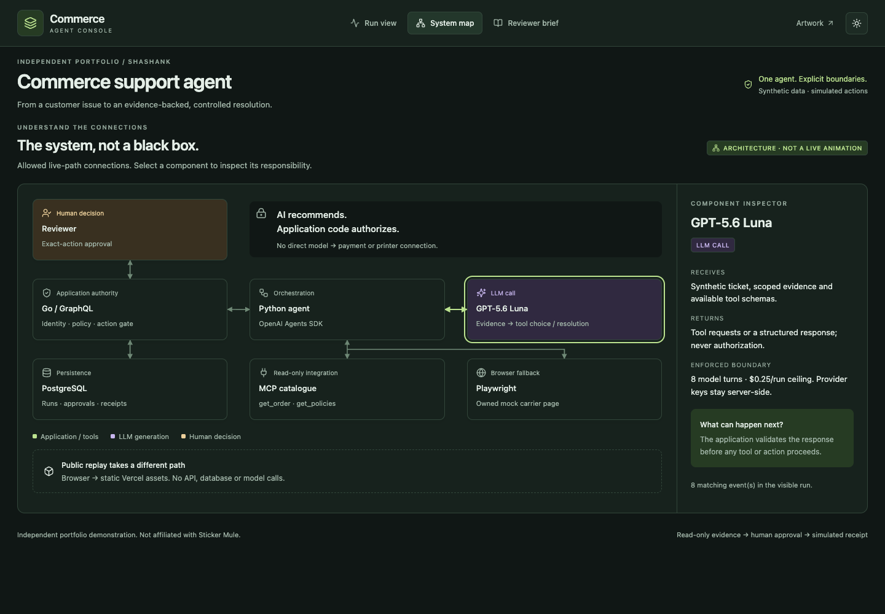
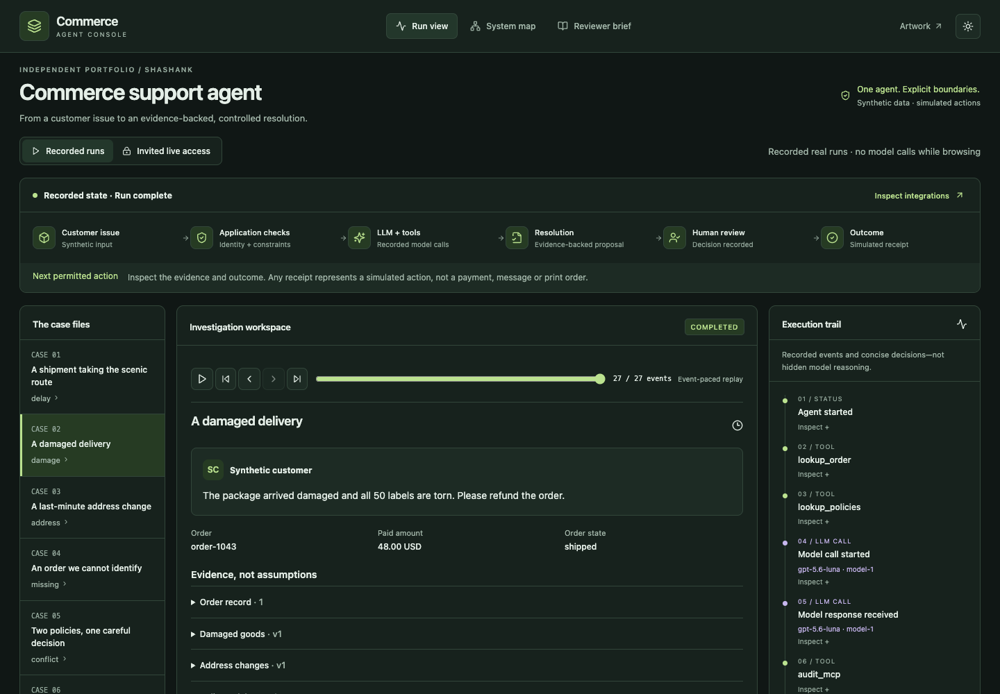

# Commerce Support Agent

Independent portfolio demonstration by Shashank. Not affiliated with Sticker Mule.

Go owns business rules and authorization; a Python OpenAI agent using GPT-5.6 Luna investigates synthetic customer issues. React/TypeScript presents evidence, approvals and audit receipts. This is a bounded portfolio demonstration, not a real customer-support system.

No real payments, messages or customer accounts are connected. Source is available for portfolio review; no permissive open-source licence has been granted for original project code.

[Explore the genuine recorded demo](https://commerce-support-agent.vercel.app) · [Reviewer brief](https://commerce-support-agent.vercel.app/#brief) · [Architecture](docs/ARCHITECTURE.md) · [Release status](docs/RELEASE_STATUS.md)

Invite-only hosted execution is verified; public replays need no invitation, backend or API key. See the companion [Artwork Proof Agent](https://github.com/sha-shank-03/artwork-proof-agent).

The connected console opens on an interactive system map. Run view exposes synchronized replay, evidence, exact-action approval boundaries and real per-call model telemetry. Reviewer brief provides architecture, actual evaluation history and limitations. The redesigned deployment passed 27 hosted browser checks across Chromium, Firefox and WebKit; see [UI verification](docs/UI_VERIFICATION.md).

## Interface



The actual deployed console, not a mockup. Select a component to inspect its inputs, outputs and enforced boundary.

<details>
<summary>Recorded investigation workspace</summary>



Synthetic recorded run; browsing this view makes no model calls. [Capture details](docs/screenshots/README.md).

</details>

## What to try

- Replay seven genuine GPT-5.6 Luna investigations without a backend or API key.
- Inspect versioned policy/order evidence, a read-only MCP lookup and an application-owned carrier browser fallback.
- With an invitation, investigate a damaged order, review the exact refund, approve or reject it, then inspect the simulated receipt.
- Refresh during approval: the checkpoint is in PostgreSQL, not browser memory.

The current Luna evaluation set passed **39/40 task cases (97.5%)** and **40/40 action-safety audits**. One browser case stopped safely at validation without proposing or executing an action; it remains a failure in the reported score. Earlier attempts and the corrected grader are retained in [the evaluation report](docs/EVALUATIONS.md). These results are not a claim of production reliability or forty distinct business scenarios.

## Local setup

Requirements: Go 1.27.1+, Python 3.12, uv, Node 22+, PostgreSQL 17. Dependency locks are committed. Use a new, portfolio-only database.

```sh
uv sync --frozen
uv run playwright install chromium
go build -o bin/server ./cmd/server
export DATABASE_URL='postgresql://YOUR_LOCAL_USER@localhost:5432/portfolio_commerce'
export ALLOWED_ORIGIN='http://localhost:5173'
export LIVE_ENABLED=true
uv run python tools/with_provider.py /path/to/private.env OPENAI_API_KEY bin/server
```

In another terminal, with the same database URL:

```sh
bin/server -invite
cd web
npm ci
npm run dev
```

Open **http://localhost:5173** (not the 127.0.0.1 spelling: Origin checks are exact). The invitation is in ignored `.local/invite.txt`. Do not paste it into public issues or commit it. Alternatively, use `docker compose up --build`; it creates a dedicated local database volume and binds the API to loopback. Live execution defaults off. The container recipe must pass CI before deployment is claimed verified.

To view replays only, `cd web && npm ci && npm run dev` needs no backend, database or credentials. The Vercel `/api` rewrite points to the isolated Railway backend, but replay mode never requests it.

## Verification

```sh
TEST_DATABASE_URL='postgresql://USER@localhost:5432/portfolio_commerce_test' go test -race ./...
uv run pytest -q
cd web
node codegen.mjs
npm run build
npm test
```

Never point `TEST_DATABASE_URL` at a production database: concurrency tests reset the portfolio test aggregate. Run `DATABASE_URL=... uv run python evals/run.py` against the local, live-enabled API for real-provider evaluation. It creates synthetic invitations and charges the same application budget as normal runs. Set `LIVE_BROWSER_TEST=true` and `DATABASE_URL` when explicitly running the additional real-model browser tests.

## Read next

- [Architecture and API boundaries](docs/ARCHITECTURE.md)
- [Design note: an approval is not a boolean](docs/DESIGN_NOTE.md)
- [Threat model and limitations](docs/SECURITY.md)
- [Operations, cost controls and release checklist](docs/OPERATIONS.md)
- [Hosted deployment and invitation commands](docs/HOSTING.md)
- [Walkthrough and interview questions](docs/INTERVIEW.md)
- [Ownership and dependency notices](NOTICE.md)
