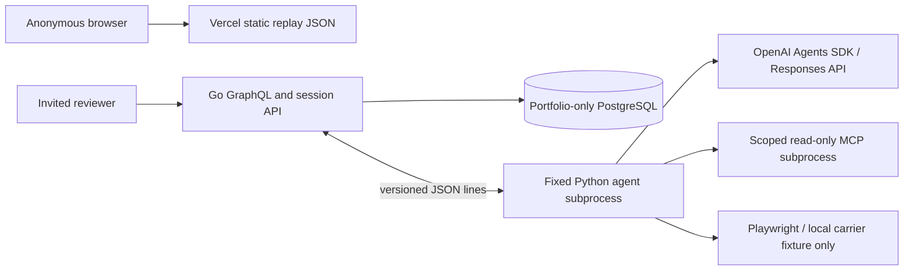

# Architecture

The public replay path has no edge to the backend. All data is synthetic. Go validates identity, origin, invitation expiry, run ownership, quotas, exact action digest and current order version. Python receives a scoped order/policy snapshot, not a database connection or payment credentials. A single supervised process per run has a 170-second deadline; there is no model-generated shell command.

## Agent versus application

The model selects read-only investigation tools and proposes a resolution. Go computes money in integer cents and validates eligibility. Calling the SDK's approval-gated `execute_action` interrupts before its body runs. Go persists the SDK checkpoint and the proposal. A reviewer approves an exact SHA-256 digest; a newly supervised worker restores the checkpoint. Application code supplies the digest without asking the LLM to transcribe it. Go rechecks the decision and order version before writing a simulated receipt. Duplicate approved requests return the existing receipt.

The MCP server exposes only `get_order` and `get_policies`; the catalogue is immutable and scoped to this run. Browser fallback starts an application-owned loopback HTTP fixture and allows only its exact GET URL. It cannot navigate to a real carrier, filesystem URL or arbitrary destination.

## Persistence trade-off

For this very small demo, PostgreSQL stores one JSONB aggregate guarded by `SELECT ... FOR UPDATE`. This serializes invitations, reservations, leases, proposals and receipts across processes, making the race boundaries explicit. It is intentionally **not** a high-throughput database design. At larger scale, split entities into tables, use indexed ownership/expiry columns, row-level run locks and a transactional outbox. Migration 001 is versioned and idempotent; future upgrades need explicit numbered migrations, not edits to historical SQL.

Stored entities: invitation hashes, session hashes, runs, tool events, evidence, approval decisions, receipts, token usage, spending reservations and SDK checkpoints. Seven-day run retention is enforced on access; physical cleanup happens on subsequent successful transactions. The budget ledger remains so expired runs cannot reset monthly spending.

## Contracts

`schema.graphql` is generated from the Go schema. `web/src/operations.graphql` generates a TypeScript SDK; Zod verifies received/replayed objects at runtime. GraphQL queries: `tickets`, `runs`, `run`, `runEvents(after:)`. Mutations: `startRun`, `clarifyRun`, `approveRun`, `rejectRun`, `cancelRun`, `resumeRun`. `POST /session` exchanges an invitation for an HTTP-only cookie. `/health` is liveness; `/ready` verifies DB connectivity and reports whether live mode is enabled.

Worker protocol v1: an initial run snapshot, then request/response messages with version and correlation ID. Allowed message kinds are `reserve`, `usage`, `tool`, `checkpoint`, `done`, `error`. Unknown messages, stale leases and unsupported tools fail closed. Prompt/checkpoint version changes invalidate old resumes rather than silently applying different behavior.

## Recovery

No automatic provider retries. A cancelled lease cannot execute subsequent tools. Uncertain in-flight calls consume their reserved estimate conservatively. Expired workers become recoverable; a reviewer must request resumption explicitly. Existing receipts prevent duplicate simulated effects. A fresh page can re-open live access and load the latest owned run from the secure session, with no invitation stored in browser storage.
